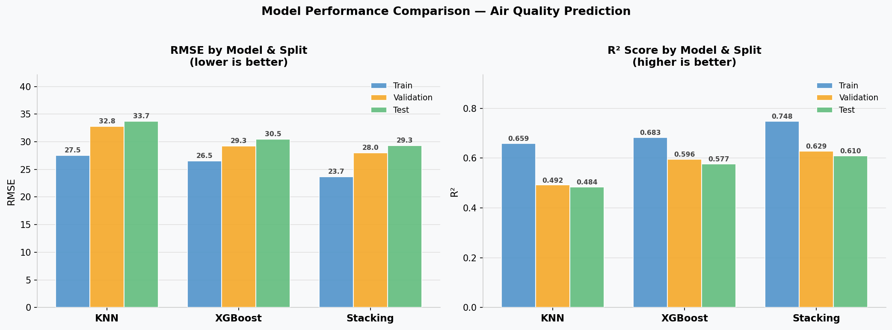

# 🌍 Air Quality Prediction - ML Pipeline

### Zindi Africa Challenge | Satellite-Based PM2.5 Forecasting

---

## 📌 Project Goal

Predict the **mean daily air quality** (a PM2.5 proxy) for monitoring stations across Africa using satellite-derived atmospheric measurements and meteorological data.

The goal is to build a robust, leakage-free machine learning pipeline that generalises across locations and dates, enabling air quality estimation even in regions with sparse or no ground-based sensors.

Project link: https://zindi.africa/competitions/zindiweekendz-learning-urban-air-pollution-challenge

---

## 🧩 Problem Statement

Ground-level air quality monitoring stations are expensive and unevenly distributed. Most of Africa has very limited coverage. Satellites, however, observe the entire continent daily.

The challenge is to bridge the gap: given a rich set of satellite and weather readings for a specific location and date, can we predict what a ground sensor would have measured?

This is a **supervised regression** problem:

- **Input:** 74 satellite + meteorological features per station-day observation
- **Target:** `target` - mean daily air quality reading (PM2.5 proxy, µg/m³)
- **Evaluation metric:** Root Mean Squared Error (RMSE)

---

## 📦 Dataset

The dataset covers **~30,500 daily observations** across **340 monitoring stations** over a 94-day window (January – April 2020).

Each row represents one station on one day, identified by `Place_ID` and `Date`.

### Feature Groups (74 total)

| Group                   | Source         | # Features | What it captures                                |
| ----------------------- | -------------- | ---------- | ----------------------------------------------- |
| **Meteorology**   | NOAA GFS       | 6          | Temperature, humidity, wind, precipitable water |
| **NO₂**          | Sentinel-5P L3 | 13         | Primary pollutant - combustion, traffic         |
| **CO**            | Sentinel-5P L3 | 8          | Primary pollutant - incomplete combustion       |
| **O₃**           | Sentinel-5P L3 | 7          | Secondary pollutant - photochemical reactions   |
| **SO₂**          | Sentinel-5P L3 | 9          | Primary pollutant - industry, volcanoes         |
| **HCHO**          | Sentinel-5P L3 | 8          | Volatile organic compound - biomass burning     |
| **Aerosol Index** | Sentinel-5P L3 | 6          | UV-absorbing particulate indicator              |
| **Cloud**         | Sentinel-5P L3 | 11         | Cloud interference correction                   |
| **CH₄**          | Sentinel-5P L3 | 7          | Greenhouse gas (dropped ->81% missing)          |

> Full feature descriptions with units and value ranges are in [`features_explanation.md`](features_explanation.md).

### Key Data Challenges

- **High missingness** in satellite bands (CH₄: ~81%, SO₂/HCHO: ~24%)
- **Sensor zeros** represent missing readings, not actual zero values
- **Angle redundancy** - solar/sensor azimuth & zenith angles are recorded independently for each satellite band, creating ~32 collinear columns from the same underlying geometry
- **Sparse stations** - some stations have very few observations, making interpolation unreliable

---

## 🔬 Approach & Methodology

### 1. No-Leakage Data Split 

The dataset is split **immediately after loading**, before any analysis or preprocessing. All EDA and pipeline fitting happens on `X_train` exclusively.

| Split      | Size | Purpose                                 |
| ---------- | ---- | --------------------------------------- |
| Train      | 60%  | Model training & pipeline fitting       |
| Validation | 20%  | Model selection & hyperparameter tuning |
| Test       | 20%  | Final held-out evaluation               |

### 2. Exploratory Data Analysis (on `X_train` only)

- Inspected column types, non-null counts, and missing value patterns
- Replaced sensor zeros with `NaN` (data format fix, applied before split)
- Filtered stations with fewer than 40 observations to remove unreliable entries
- Plotted feature-target correlations before and after feature engineering

> Full EDA & Feature Engineering is in `EDA_Feature-Engineering.ipynb`.

### 3. Feature Engineering (inside the Pipeline)

All transformations are encapsulated in a sklearn `Pipeline` to prevent leakage:

| Step                | Transformation                                                  | Rationale                      |
| ------------------- | --------------------------------------------------------------- | ------------------------------ |
| Drop columns        | Remove CH₄, target stats, composite ID                         | Leakage / too sparse           |
| Imputation          | Per-station grouped median → global median fallback            | Station-aware NaN filling      |
| Angle consolidation | 32 per-band angles →`relative_azimuth` + `relative_zenith` | Eliminate collinearity         |
| AMF calculation     | Slant / vertical column ratios for NO₂, SO₂, HCHO             | Encode optical path length     |
| NO₂ Tropo Ratio    | Tropospheric NO₂ / total NO₂                                  | Isolate ground-level pollution |
| Cloud thickness     | Cloud base pressure − cloud top pressure                       | Quantify cloud masking effect  |
| Cloud fraction      | Mean of per-band cloud fractions                                | Reduce collinearity            |
| Sensor altitude     | Mean of per-band sensor altitudes                               | Reduce collinearity            |
| Scaling             | `RobustScaler` (median/IQR)                                   | Robust to atmospheric outliers |

### 4. Modelling

Three models were trained and compared, all using the **same shared preprocessing pipeline**:

| Model                    | Description                                                                                   |
| ------------------------ | --------------------------------------------------------------------------------------------- |
| **KNN** (baseline) | K-Nearest Neighbours (k=5) - simple non-parametric baseline                                   |
| **XGBoost**        | Gradient boosted trees with `RandomizedSearchCV` hyperparameter tuning (15 iter, 3-fold CV) |
| **Stacking**       | Random Forest + KNN base learners → Polynomial (degree 3) Linear Regression meta-learner     |

---

## 🛠️ Libraries & Why

| Library                      | Purpose                                                              |
| ---------------------------- | -------------------------------------------------------------------- |
| `pandas`                   | Data loading, manipulation, and groupby operations                   |
| `numpy`                    | Numerical operations, NaN/inf handling                               |
| `matplotlib` / `seaborn` | EDA visualisations and correlation heatmaps                          |
| `scikit-learn`             | Pipeline, imputer base class, scalers, metrics, model selection      |
| `xgboost`                  | Gradient boosted trees - strong baseline for tabular data            |
| `scipy`                    | Probability distributions for `RandomizedSearchCV` parameter grids |

---

## 📁 Project Structure

```
├── Data/
│   ├── Train.csv                        # Training data (~30,500 rows, 82 columns)
│   └── Test.csv                         # Competition test set
├── Model/
│   ├── EDA_Feature-Engineering.ipynb    # Full EDA & feature engineering notebook
│   ├── Project.ipynb    		 # Full ML pipeline notebook (split → EDA → models)
│   └── function.py                      # Shared utility functions & custom transformers 
├── features_explanation.md              # Feature descriptions with units and value ranges
├── Images/
│   ├── model_comparison.png             # RMSE & R² bar charts across all models
│   ├── actual_vs_predicted.png          # Actual vs Predicted scatter for Stacking model
│   └── redidual.png                     # Residual plot
└── README.md                            # This file
```

---

## ▶️ How to Run

### **`macOS`** type the following commands :

- For installing the virtual environment you can either use the [Makefile](Makefile) and run `make setup` or install it manually with the following commands:

  ```BASH
  make setup
  ```

  After that active your environment by following commands:

  ```BASH
  source .venv/bin/activate
  ```

Or ....

- Install the virtual environment and the required packages by following commands:

  ```BASH
  pyenv local 3.11.3
  python -m venv .venv
  source .venv/bin/activate
  pip install --upgrade pip
  pip install -r requirements.txt
  ```

### **`WindowsOS`** type the following commands :

- Install the virtual environment and the required packages by following commands.

  For `PowerShell` CLI :

  ```PowerShell
  pyenv local 3.11.3
  python -m venv .venv
  .venv\Scripts\Activate.ps1
  python -m pip install --upgrade pip
  pip install -r requirements.txt
  ```

  For `Git-bash` CLI :

  ```BASH
  pyenv local 3.11.3
  python -m venv .venv
  source .venv/Scripts/activate
  python -m pip install --upgrade pip
  pip install -r requirements.txt
  ```

  **`Note:`**
  If you encounter an error when trying to run `pip install --upgrade pip`, try using the following command:

  ```Bash
  python.exe -m pip install --upgrade pip
  ```

> `function.py` must be in the same directory as the notebooks - it is imported via `from function import *`.

---

## 📊 Results

### Model Comparison - Validation & Test Performance

| Model              | Train RMSE       | Train R²       | Val RMSE         | Val R²         | Test RMSE        | Test R²        |
| ------------------ | ---------------- | --------------- | ---------------- | --------------- | ---------------- | --------------- |
| **KNN**      | 27.518           | 0.659           | 32.792           | 0.492           | 33.700           | 0.484           |
| **XGBoost**  | 26.536           | 0.683           | 29.252           | 0.596           | 30.493           | 0.577           |
| **Stacking** | **23.677** | **0.748** | **28.028** | **0.629** | **29.306** | **0.610** |

### Model Performance Charts



---

### Model Improvement Progression

Improvement measured on the **Test set** (the held-out, unseen split).

| Step            | Model           | Test RMSE | RMSE Improvement                   | Test R² | R² Improvement                   |
| --------------- | --------------- | --------- | ---------------------------------- | -------- | --------------------------------- |
| Baseline        | KNN             | 33.700    | -                                  | 0.484    | -                                 |
| Step 1 →       | XGBoost         | 30.493    | ↓ 3.207&nbsp;(−9.5%)             | 0.577    | ↑ 0.093&nbsp;(+19.2%)            |
| Step 2 →       | Stacking        | 29.306    | ↓ 1.187&nbsp;(−3.9%)             | 0.610    | ↑ 0.033&nbsp;(+5.7%)             |
| **Total** | KNN → Stacking | -         | **↓ 4.394 &nbsp;(−13.0%)** | -        | **↑ 0.126 &nbsp;(+26.0%)** |

> The biggest single gain comes from moving from KNN to XGBoost (−9.5% RMSE), which validates the value of gradient boosting on this tabular dataset. The Stacking model adds a further incremental improvement on top.

---

### Key Observations

- **Stacking is the best performing model** across all splits, achieving a test RMSE of **29.31** and R² of **0.61**
- **XGBoost** is a strong second - competitive with Stacking on validation and significantly better than KNN
- **KNN** serves as a useful baseline but shows the largest train-to-test generalisation gap (~6 RMSE points), suggesting it overfits to local neighbourhood structure
- All three models show a reasonable train-to-test gap with no signs of severe overfitting, validating the leakage-free pipeline design
- An R² of ~0.61 means the best model explains 61% of the variance in daily air quality. A solid result given the inherent noise in satellite-retrieved measurements

---
